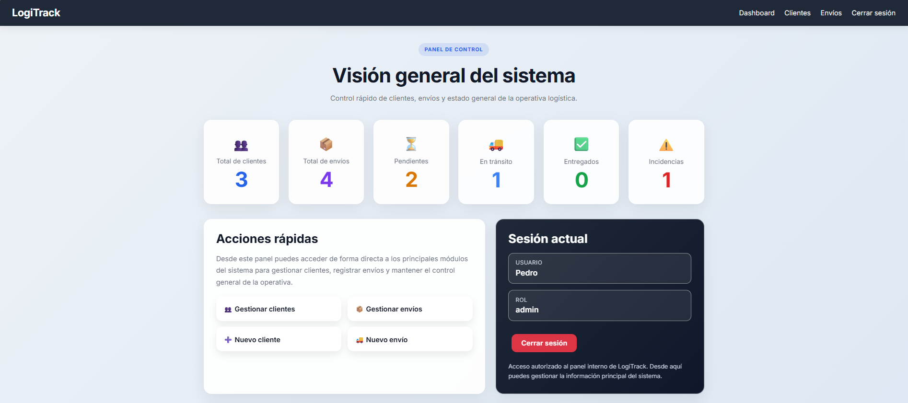
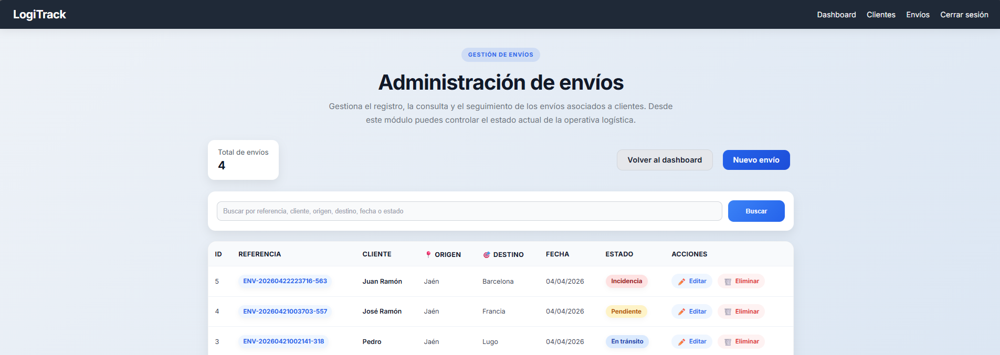
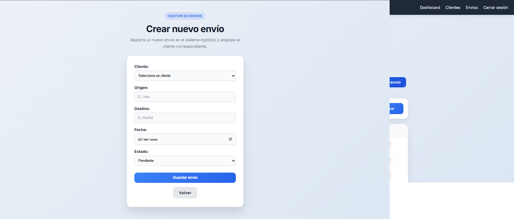

# LogiTrack

LogiTrack es una aplicación web de gestión logística desarrollada como proyecto práctico para portfolio y prácticas de Desarrollo de Aplicaciones Web.

El proyecto está inspirado en procesos reales de administración y operaciones logísticas, como la gestión de clientes, seguimiento de envíos, control de estados e incidencias.

## Capturas del proyecto

### Dashboard


### Gestión de envíos


### Crear / editar envío


## Tecnologías utilizadas

- PHP (arquitectura MVC)
- MySQL
- HTML5 + CSS3
- JavaScript
- Bootstrap
- Chart.js
- XAMPP / phpMyAdmin
- Git / GitHub

## Funcionalidades principales

- Página principal pública
- Login con autenticación por sesión
- Dashboard con estadísticas y gráfico de estados
- Gestión de clientes (CRUD completo)
- Gestión de envíos (CRUD completo)
- Estados de envío: Pendiente, En tránsito, Entregado, Incidencia
- Badges visuales por estado
- Buscador de envíos
- Diseño responsive

## Instalación local

1. Clonar el repositorio:
```bash
git clone https://github.com/NickoBustamante/logitrack.git
```
2. Copiar la carpeta en `C:\xampp\htdocs\logitrack`
3. Abrir XAMPP y activar Apache y MySQL
4. Crear base de datos `logitrack` en phpMyAdmin
5. Importar el archivo `database/logitrack.sql`
6. Copiar `config/conexion.example.php` como `config/conexion.php` y ajustar credenciales
7. Acceder en: `http://localhost/logitrack`

## Autor

Pedro Nicolás Bustamante Valverdi — DAW 2026  
[GitHub](https://github.com/NickoBustamante)